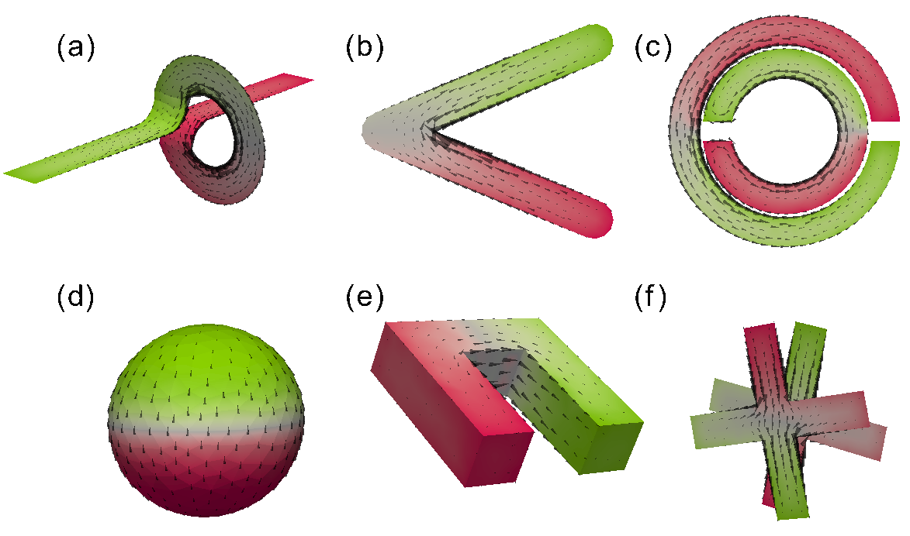

.. OpenModes documentation master file, created by
   sphinx-quickstart on Tue Nov 05 15:21:38 2013.
   You can adapt this file completely to your liking, but it should at least
   contain the root `toctree` directive.

Overview
========

OpenModes is a code aimed at solving the modes of open electromagnetic structures.
Using these modes, broadband models of these elements can be created, enabling
excitation, coupling between them and scattering to be solved easily.

Potential applications include metamaterials, (nano) antennas and other systems
based on scattering from resonant elements. It is based on a fully numerical model
of the system created using the method of moments (MOM).

The techniques used in this package, and the scientific results obtained, are described in the
following publications and presentations:

- *Interference between the modes of an all-dielectric meta-atom*, `2017 paper <http://dx.doi.org/10.1103/PhysRevApplied.7.034006>`_
  or `2016 arXiv preprint <https://arxiv.org/abs/1610.04980>`_
- *Resonant dynamics of arbitrarily shaped meta-atoms*, `2014 published paper <http://dx.doi.org/10.1103/PhysRevB.90.075108>`_ or
  `2014 arXiv preprint <http://arxiv.org/abs/1405.3759>`_
- *Modes in open metamaterial and nanophotonic systems*, `web presentation <http://people.physics.anu.edu.au/~dap124/aip2014/>`_.

This program was written by David Powell, a Senior Lecturer with the School of Engineering and
Information Technology at the University of New South Wales, Canberra Campus.

To begin using the software, follow the :doc:`getting started instructions <gettingstarted>`.

The :doc:`examples` give an overview of OpenModes' capabilities, and can be viewed online.

**To quickly view output of examples online, click**
`here <http://nbviewer.jupyter.org/github/DavidPowell/openmodes-examples/tree/master/Index.ipynb>`_.

.. toctree::
   :hidden:

   gettingstarted
   whatsnew
   install
   examples
   features
   using
   maths
   thanks
